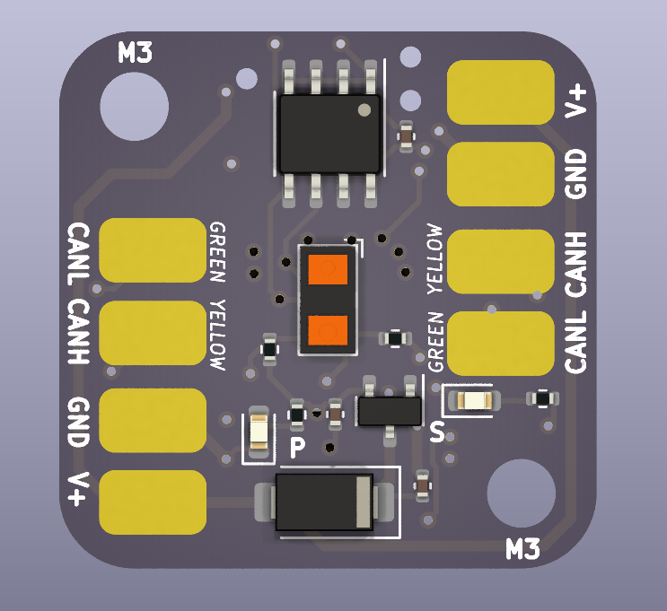

# Grapple LaserCAN
Welcome to the open-source repository for the Grapple LaserCAN! That's right, everything's open source from the board files to the firmware.

## [Looking for docs?](docs/getting-started.md)

## Project Directories
- [LaserCAN-Board](LaserCAN-Board) is the KiCAD project that contains the LaserCAN board files. 
- [lasercan-common](lasercan-common) are common libraries used between the firmware and bootloader.
- [lasercan-bootloader](lasercan-bootloader) is the CAN bootloader for the LaserCAN, written in Rust. The bootloader allows for over-the-air (or over-the-CAN, rather) firmware updates.
- [lasercan-firmware](lasercan-firmware) is the actual firmware for the LaserCAN, including sensor measurement and acquisition, CAN communication, and everything else it does!

## Loading your own firmware
If you want to load your own firmware onto the LaserCAN, clone this repository and make your changes to `lasercan-firmware`. You can flash this image to the board by running `make firmware` and flashing the `target/lasercan-firmware-update.grplfw` file using GrappleHook.

## Flashing a new bootloader
If you for whatever reason need to flash a new bootloader, or if a custom firmware has crashed and the watchdog hasn't picked it up, you can flash a new bootloader and firmware by running `make flash`. This requires an ST-Link v2 compatible probe and a TagConnect TC-2050-NL cable to connect to the debug pads on the bottom of the LaserCAN. 