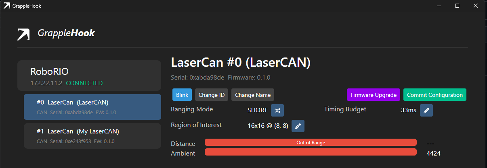

# Getting Started with LaserCAN
Getting Started with LaserCAN is easy! Follow this guide and you'll be using your sensor in no time!

## 1. Connect Power
**IMPORTANT:** Double check the FRC Rule Manual for wire gauges, PDP/PDH output selection, etc.

### Direct
To wire up your LaserCAN, connect V+ to the 6V (PWM) or 5V (DIO) source on your RoboRIO, and GND to any Ground pin on the RoboRIO.

### Daisy-Chain
Alternatively, you can power the LaserCAN from another LaserCAN by connecting the V+ pads together, and likewise for the GND pads. **DO NOT** Daisy-Chain more than 8 LaserCANs in one chain!

## 2. Connect CAN
Next, connect the CANH and CANL pads of the LaserCAN to your robot's CAN bus. This can be done in one of three ways:

### Pass-Through
Insert the LaserCAN in an existing CAN line by connecting both sides of the LaserCAN's CAN pads, "passing through" the connection to downstream devices.

### Star
Alternatively, branch off from an existing CAN connection, forming a new branch that can be connected to one side of the LaserCAN. If connecting in this manner, ensure the stub length is short (i.e. a short branch).

### Star + Pass-Through
If you have more than one LaserCAN, you can use the Star method to connect the first LaserCAN, and connect the rest through passthrough, starting at the first LaserCAN's unoccupied pads. Ensure the total stub length is also short, less than 2 meters for 1Mbps CAN 2.0B.

## 3. Power on your LaserCAN
Power on your robot to power on the LaserCAN. The orange LED should blink rapidly for 2-3 seconds before turning off. If the orange LED remains on, your LaserCAN may require a firmware update.

## 4. Download and Install GrappleHook
Download the latest version of GrappleHook for your platform here: https://github.com/GrappleRobotics/GrappleHook/releases

*Tip: If you're on windows, select the asset ending in .msi*

## 5. Run GrappleHook
Connect your RoboRIO over a USB cable, and open GrappleHook. Select RoboRIO, and hit "Connect"

## 6. Set the CAN ID
In GrappleHook, select "Change ID" and set a new CAN ID for your LaserCAN. Choose something unique from other LaserCANs, otherwise they'll conflict!

## 7. Install the libgrapplefrc Vendor Library
In VSCode, hit CTRL+SHIFT+P and select "WPILib: Manage Vendor Libraries".  Select "Install new libraries (online)" and paste the following URL: https://storage.googleapis.com/grapple-frc-maven/libgrapplefrc2024.json

## 8. Use LaserCAN!
See one of our examples: 
- [Java](example-java.md)
- [C++](example-cpp.md)